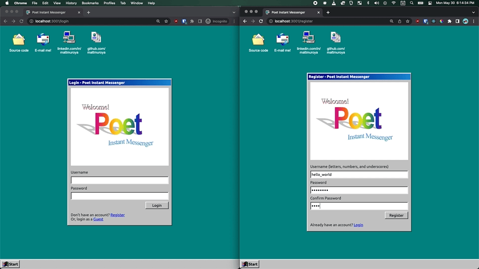
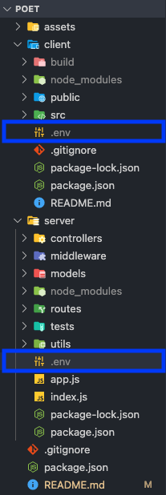
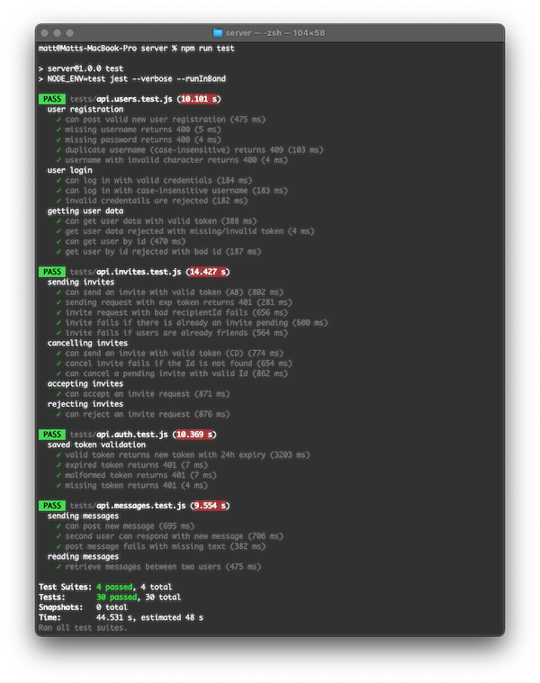

# Poet Instant Messenger

Poet is a full stack MERN (MongoDB, Express, React, and Node.js) instant messenger with real-time WebSocket communication, styled in the spirit of the retro-classic IM apps of the late ‘90s.

Try it out! https://poet.mattmuroya.com/

Poet is my first attempt at building a solo full stack web application, intended to be a learning experience and porfolio piece. This document provides directions on how to get up and running with Poet on your local machine, as well a high-level overview of the application's functional and architechtural design.

## How to Run This Application

If you would like to view the app in production, there is a live demo available at https://poet.mattmuroya.com/.

If you would like to run the app locally in development mode on your computer, you will need to set up your own instance of MongoDB, download the project files, and create two `.env` files containing the required environment variables.

### Set Up MongoDB

You can create a local MongoDB instance on your computer, or set up a hosted database with MongoDB Atlas (recommended). You can [learn more about setting up a hosted database on MongoDB's website](https://www.mongodb.com/basics/mongodb-atlas-tutorial).

Once your database has been configured, you will be able to generate "connection string" needed to connect Poet to your database.

### Download Project Files

1.  [Clone](https://docs.github.com/en/repositories/creating-and-managing-repositories/cloning-a-repository) this repository to your Desktop (or wherever you keep your projects). You can also [create a fork](https://docs.github.com/en/get-started/quickstart/fork-a-repo).
2.  Open your terminal, `cd` into the `server` directory inside the project folder, and install server dependencies.

        cd Desktop/poet/server && npm install

3.  `cd` into the `client` directory and install client dependencies.

        cd ../client && npm install

### Set Up Environment Variables

You will need to create two `.env` files which contain "environment variables." Environment variables are variables that contain sensitive data required for the application to run that, for security reasons, are not published to GitHub.

1.  Open the project folder in your text editor of choice. [Visual Studio Code](https://code.visualstudio.com/) is a popular free option.

2.  Expand the file list and add a file called `.env` inside the `client` directory, and another inside the `server` directory

    

3.  Open `server/.env` and paste in the following:

        PORT=3001

        MONGODB_URL_TEST="mongodb+srv://<your_mongodb_username>:<your_mongo_db_password@<cluster>.<string>.mongodb.net/poet_test?retryWrites=true&w=majority"

        JWT_SECRET="JvVnhoBAofPMLjfMgrPbZY4evwiyqyi3QK9KlK4jx5I8lKIVXKwKPXcgmFZSCAu"

        GUEST_PW="password"

    - `PORT=3001` instructs the dev server to run on port 3001. You must use 3001 in order for the client proxy settings to work properly in development mode.
    - `MONGODB_URL_TEST` should be replaced with the connection string you generated from your MongoDB database instance. The string should include your MongoDB access username, password, and the cluster details. You make sure you also specify a database name in your connection string (note `poet_test` appended to the example string).
    - `JWT_SECRET` can be any random string. This is the private key that your application will use to encode [JWT access tokens](https://jwt.io/) for user authorization.
    - `GUEST_PW` can by any string of at least 8 characters. This is the password that Poet will assign to the guest account when you run database utility in the next section.

4.  Open `client/.env` and paste in the following:

        REACT_APP_GUEST_PW="password"

    - `REACT_APP_GUEST_PW` should match the `GUEST_PW` you provided in the `server/.env` file.

5.  Save both files.

### Run the Guest Account Utility

Inside the `server/utils` directory, there are several utilities for populating the database with test data. We will be running a predefined NPM script to execute `guest.js` which will initialize a guest account with the password you specified in your `.env` files.

`cd` in to the `server` directory and run the guest script.

    npm run guest

If the operation fails, double-check that the connection string you provided contains the correct database credentials.

### Start the Application

In development mode, the client and server both run independently. This means you will need to open two terminal windows and start both applications.

#### Start the Server

In the first terminal window, `cd` into the `server` directory and run the development server start script.

    npm run dev

#### Start the Client

In the second terminal window, `cd` into the `client` directory and run the development client start script.

    npm start

The client should start automatically on http://localhost:3000/.

### Congratulations!

You now have a fully-functional copy of Poet running locally on your computer. You should be able to log in as a guest using the link on the login page, or create and log in with your own account. Have fun!

## Client Design

## Server Design

## Front end

The front end is a [React](https://reactjs.org/) client built using [create-react-app](https://create-react-app.dev/) and structured with [React Router](https://reactrouter.com/).

### Highlights

- Function components with `useEffect()` for performing lifecycle methods and `useState()` for managing local state.
- React Context API for global state managementment of the current user, chat, and WebSocket connection.
- Custom hook for validating the current session/auth token and fetching user details from the server.
- Retro-classic '90s styling based on the excellent [98.css by jdan](https://github.com/jdan/98.css), with a handful of custom elements and minor modifications to fonts and sizing in the interest of overall usability.

### Optimizations

- The home page at `<base>/` does not indicate chat IDs dynamically. I'd like to make the client-side routing such that the URL reads `<base>/chat/<username>` so that if the user refreshes the application, it can reopen the current chat.
- The UI doesn't notify you of missed messages. This would require extracting the individual items on the friend list to a separate component so you can render counts for each.
- Would like to add the ability to edit/delete sent messages.

## Back end

The back end is a [Node.js](https://nodejs.org/en/) server built on using the [Express](https://expressjs.com/) framework. The server also technically serves all the static client-side files from a build folder.

### Highlights

- Real-time event-driven WebSocket communication via [Socket.IO](https://socket.io/), allowing for live chat between users.
- JSON Web Token (JWT) user auth. Each time a user reloads the application, the server either refreshes the token (resetting the expiry period), or prompts re-authentication if it is missing/invalid/expired.
- Custom middlewares for error handling, token validation, and request logging (in development mode).
- Seperate development and production databases for ease of development/testing with a custom reset/sample data utility.
- Test-driven development (TDD) with [Jest](https://jestjs.io/) and [Supertest](https://github.com/visionmedia/supertest) for all API endpoints, focused mainly on segmented integration testing. Tests cover execution and error handling for authentication, user administration, user actions (sending invites and adding friends), and sending and receiving messages.

### Optimizations

- Most API routes require token authorization, however an authorized user could technically request any data they want by accessing the endpoint and setting their token to the `Authorization` header. I would like to improve security by restricting access to a one's own data only.
- There are some event handlers/hooks on the front end e.g. `useAuth()` which require multiple fetch requests to retrieve the necessary data. It would improve speed and efficiency to modify server response data to eliminate the need for multiple requests.

## Development challenges

- Architecture: the planning stage is critical when building any full stack application. If you don't plan for loose coupling, modularity and extensibility, it can be difficult to implement new features. For example, in order to implement public/group chats, I'll need to refactor the Message schema and/or client message rendering entirely; currently, the entire front end depends on a very specific 1:1 sender-recipient relationship to render messages in the chat window. In a group chat, there is no specific recipient, unless I am able to treat a chat room as if it were another user ("chat" state in the app). To be determined...
- State management: At first, the current user details, chat, and WebSocket data were all managed in a single parent component; this required some messy prop-drilling until I refactored to manage these things globally with [React's Context API](https://reactjs.org/docs/context.html). I'm looking forward to exploring how [Redux](https://redux.js.org/) could improve my future projects.
